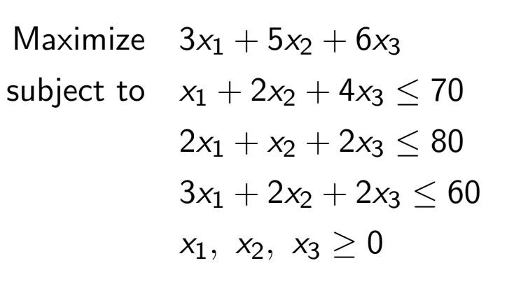

# Linear Programming & Simplex Algorithm
This project implements the simplex method to solve linear optimization problems using Python and SciPy.

**Project description**
Linear optimization is an essential technique for maximizing or minimizing an objective function under linear constraints.

This project implements the simplex algorithm, an efficient method for solving linear optimization problems applied to concrete cases such as :

**Princpial step :**

1.  Rewriting the problem in standard form :
    From an initial system combining our objective function and the associated constraints
       

    
    - Any equality constraint can be written as two inequalities
      
      
    - Any ≥ constraint can be written as a ≤ constraint:
      
      
      
    - Any minimization problem can be turned into a maximization
      problem:
      
     
  
